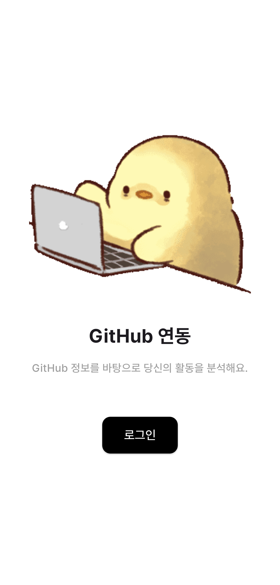
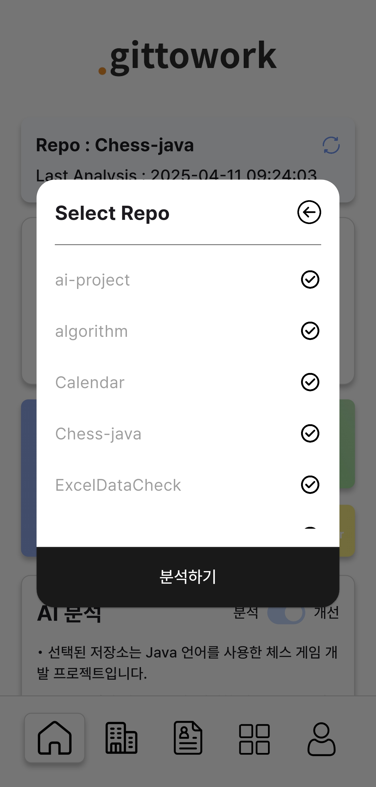
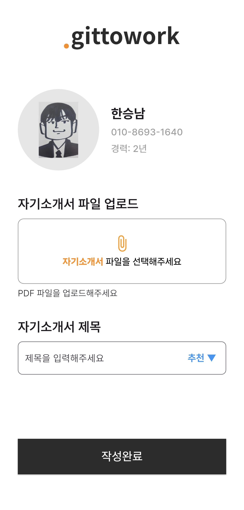
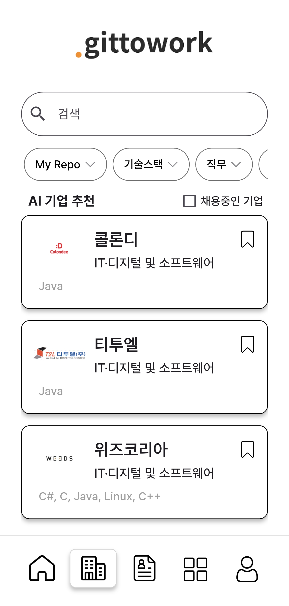
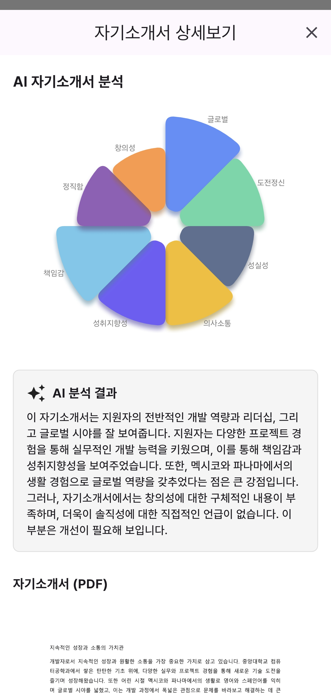
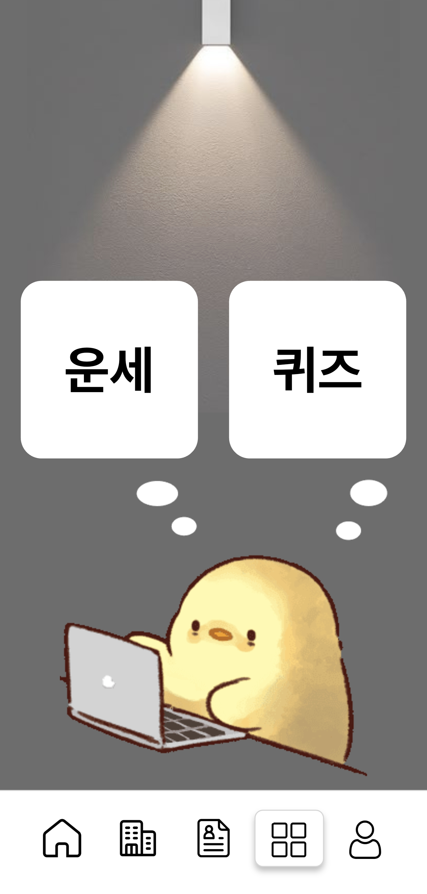

저희 gittowork에서 제공하는 기능에 대한 소개는 시연을 통해서 보여드리겠습니다. 

### 시연 시간

- 시연자 : 한승남

- 시연 시나리오 #1
    - github 로그인 → 시연자 템포대로 진행하세요. 발표자가 속도 맞추겠습니다.
    - 발표자
        - 사용자는 github 계정을 통해 로그인합니다. 그리고 이름, 전화번호와 같은 개인정보와 경력, 관심 비즈니스 분야를 입력합니다.
        - 경력이나 관심 비즈니스 분야는 기업과 채용 공고 추천 하는데 데이터로 사용됩니다.
        - 이렇게 사용자의 기본 정보를 입력하게 되면 메인 화면에 github 분석 화면이 나오게 됩니다.

    

- 시연 시나리오 #2
    - github 분석 → 레포지토리 하나 선택하여 조합 생성, 분석하기 클릭, 로딩 창 돌아가는 것까지 확인
    - 발표자
        - 먼저 github 분석을 해보도록 하겠습니다. 사용자는 자신의 github에 public으로 올라와있는 저장소 중에 하나 이상의 저장소를 선택하여 분석을 요청할 수 있습니다.
        - 사용자가 분석할 저장소들을 선택하여 조합을 생성하고 분석을 요청하면 분석이 시작되고, 분석이 완료가 되면 알림이 와서 결과를 확인할 수 있습니다.
        - 분석 결과가 도착할 때까지 먼저 자기소개서 분석을 소개해드리도록 하겠습니다.

    
    

- 시연 시나리오 #3
    - 자기소개서 업로드 및 분석 → 자기소개서 업로드하고 분석 결과 기다리기
    - 발표자
        - 사용자는 자기소개서를 업로드하여 8가지 역량에 대한 점수와 요약, 개선방안에 대한 피드백을 받아 볼 수 있습니다.
        - 자기소개서 분석도 시간이 걸리기 때문에 업로드 하고 분석 결과가 도착할 때까지 기다리도록 하겠습니다.

- 시연 시나리오 #4
    - github 분석 완료 알람 도착 → 알람 클릭하여 github 분석 결과 확인
    - 발표자
        - github 분석이 완료되었다는 알람이 왔습니다 / 아까 왔던 것으로 보였는데요. 바로 분석 결과를 확인해보도록 하겠습니다.
        - 스타 개수, 커밋 횟수, Pull Request 개수, 이슈 개수 등 협업 관련 횟수와 코드 품질 분석 결과로 나온 전체적인 등급을 확인할 수 있습니다.
        - 또 해당 저장소의 주 언어 비율이 어떻게 형성이 되어있는지 확인할 수 있습니다.
        - 마지막으로 AI의 분석결과와 개선방안도 제공받을 수 있습니다.

- 시연 시나리오 #5
    - 채용 공고 확인
    - 발표자
        - 그럼 이제 github 분석 결과에 따른 맞춤 기업 및 채용 공고를 확인해보도록 하겠습니다.
        - 분석한 저장소 조합을 채용 공고 추천에도 그대로 사용할 수 있으며, 기술 스택, 직무, 경력, 지역, 채용 중인 공고가 있는지 없는지로 필터링하여 검색할 수 있습니다.
        - 기업 상세 정보는 기본 정보들과 채용 중인 공고, 복리후생 등이 어떤 것이 있는지 확인할 수 있습니다.

- 시연 시나리오 #6
    - 자기소개서 분석
    - 발표자
        - 아까 올려둔 자기소개서 분석 결과를 확인해 보겠습니다.
        - AI 기반으로 자기소개서를 분석하여 8가지 역량에 대한 점수를 받아볼 수 있습니다.
        - 또, 자기소개서 요약 결과와 개선방안도 받아볼 수 있습니다.

- 시연 시나리오 #7
    - 엔터테인먼트
    - 발표자
        - 또, 저희 gittowork 에는 다양한 즐길거리가 준비되어 있습니다.
        - 오늘의 운세도 받아볼 수 있고, 자기소개서, CS, 인성면접 등 취업에 도움이 될 수 있는 퀴즈를 풀어볼 수도 있습니다.

